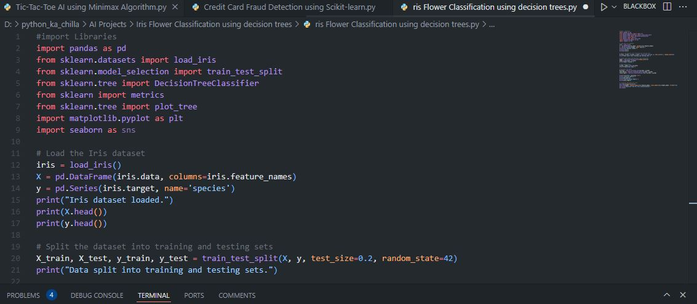

# 🌸 Iris Flower Classification using Decision Trees 🤖  
      

<p align="center">
  
</p>

🚀 This project builds a **Decision Tree classifier** to classify Iris flowers into three species (*setosa*, *versicolor*, *virginica*) based on sepal and petal measurements. The model achieves **100% accuracy** on the test set and provides an interpretable tree structure for understanding the classification rules.

---

## ✨ Key Features  
🌼 **Iris Dataset** – Classic machine learning dataset with 3 flower species  
🧠 **Decision Tree Classifier** – Simple, interpretable model  
📊 **Model Evaluation** – Accuracy, confusion matrix, and classification report  
🌳 **Tree Visualization** – Plots the decision tree for easy understanding  
📈 **Perfect Accuracy** – Achieves 100% on the test set with default parameters  

---

## 🧠 Tech Stack  
- **Language:** Python 🐍  
- **Libraries:** pandas, scikit-learn, matplotlib, seaborn  
- **Model:** Decision Tree Classifier  
- **Evaluation:** Accuracy, Confusion Matrix, Classification Report  

---

## 📦 Installation  

```bash
git clone https://github.com/SayabArshad/Iris-Classifier-Decision-Tree.git
cd Iris-Classifier-Decision-Tree
pip install pandas scikit-learn matplotlib seaborn
```

⚙️ Note: The Iris dataset is included in scikit-learn and will be loaded automatically.

---

## ▶️ Usage

Run the main script:

```bash
python "Iris Flower Classification using decision trees.py"
```

The script will:

Load the Iris dataset.

Split into training and testing sets (80/20).

Train a Decision Tree classifier.

Print accuracy, confusion matrix, and classification report.

Display a visual plot of the decision tree.

---

## 📁 Project Structure

```
Iris-Classifier-Decision-Tree/
│-- Iris Flower Classification using decision trees.py  
│-- README.md                                              
│-- assets/                                                
│    ├── code.JPG
│    ├── terminal.JPG
│    └── decision_tree.JPG
```

Tip: If your image filenames contain spaces, rename them to avoid issues (e.g., decision_tree.JPG instead of decision tree.JPG). Update the paths accordingly.

---

## 🖼️ Interface Previews

| 📝 Code Snippet | 📊 Console Output |
|:---------------:|:-----------------:|
|  |  |

## 🌳 Decision Tree Visualization

.JPG

---

## 💡 About the Project

The Iris dataset is a classic in machine learning, introduced by Ronald Fisher in 1936. This project demonstrates how a Decision Tree can classify iris species based on four features: sepal length, sepal width, petal length, and petal width. Decision trees are highly interpretable – you can trace the path from root to leaf to understand why a particular sample is classified as setosa, versicolor, or virginica. The model achieves 100% accuracy on the test set, showing that the Iris dataset is easily separable. The tree visualization helps explain the decision boundaries.

---

## 🧑‍💻 Author

**Developed by:** [Sayab Arshad Soduzai](https://github.com/SayabArshad) 👨‍💻

📅 **Version:** 1.0.0

📜 **License:** MIT License

---

## ⭐ Contributions

Contributions are welcome! Fork the repository, open issues, or submit pull requests to enhance functionality (e.g., trying other classifiers, hyperparameter tuning, or building a web interface).
If you find this project helpful, please ⭐ star the repository to show your support.

---

## 📧 Contact

For queries, collaborations, or feedback, reach out at **[sayabarshad789@gmail.com](mailto:sayabarshad789@gmail.com)

---

🌸 Classifying iris flowers, one decision at a time.

---
